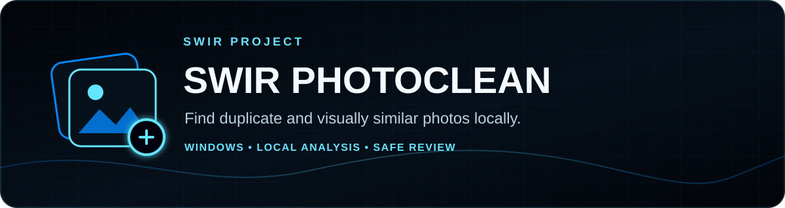
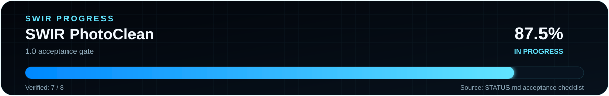

<!-- SWIR-README-STANDARD:v2 -->

<div align="center">



# SWIR PhotoClean

**Find duplicate and visually similar photos locally, compare them and review cleanup safely.**


[](https://github.com/Swir)
[](https://github.com/Swir/SwirPhotoClean/stargazers)

[**Highlights**](#-highlights) · [**Download**](#-quick-start) · [**Safety**](#-privacy--safety) · [**1.0 Gate**](#-10-acceptance-progress) · [**Releases**](#-releases)

</div>


## 📍 Project Status

| Item | Status |
|---|---|
| Current public preview | **v0.3.0** — Polish / English |
| Platform | Windows 10 / 11 |
| Processing | Local; no photo upload required by the application |
| Latest public release | [v0.3.0 prerelease](https://github.com/Swir/SwirPhotoClean/releases/tag/v0.3.0) |
| 1.0 acceptance gate | **6 / 7 = 85.7%** from the authoritative checklist in [`STATUS.md`](STATUS.md) |
| Remaining 1.0 blocker | Confirm successful move-to-Recycle-Bin **and restore** on Windows while preserving the original |

<p align="center">
  
</p>

The percentage above measures only the explicit **1.0 acceptance gate**. It does not claim that every possible future feature is complete or that v0.3.0 is a stable 1.0 release.

## 🚀 Overview

**SWIR PhotoClean** is a Windows duplicate-photo and similar-image finder designed for review-first cleanup. It analyzes images locally, groups exact duplicates and visually similar files, provides side-by-side comparison and moves user-selected files to the Windows Recycle Bin only when the operation can be confirmed safely.

It does **not** automatically select every duplicate for deletion, and similar-image matches always require human review.

## ✨ Highlights

| Feature | What it does |
|---|---|
| 🔐 Exact duplicate detection | Uses full-file SHA-256 comparison for byte-identical files. |
| 👁️ Similar-photo detection | Combines lightweight image hashes, aspect ratio and low-resolution colour comparison. |
| 🖼️ Side-by-side review | Shows two selected images with dimensions, sizes and full paths. |
| 📁 Multi-folder scans | Scans several folders and their subfolders in one session. |
| ♻️ Safe cleanup | Nothing is auto-selected; chosen files are rechecked before a Windows Recycle Bin operation. |
| 🛡️ Group protection | Prevents marking every image from the same result group. |
| 📄 CSV export | Exports scan results for further review. |
| 🌐 PL / EN interface | Switches between English and Polish without discarding current scan state. |
| 🔒 Local-first design | Photo analysis stays on the computer. |

## ⚙️ Quick Start

### Recommended — Windows preview release

Download [SWIR PhotoClean v0.3.0](https://github.com/Swir/SwirPhotoClean/releases/tag/v0.3.0):

1. Download `SwirPhotoClean-0.3.0-Windows.zip`.
2. Extract the **entire archive**.
3. Run `SwirPhotoClean.exe` from the extracted folder.
4. Keep the complete application folder together; do not move only the EXE.

v0.3.0 is a **prerelease/test-stage build**, not a stable 1.0 release.

### From source

```powershell
git clone https://github.com/Swir/SwirPhotoClean.git
cd SwirPhotoClean
py -3.12 -m venv .venv
.\.venv\Scripts\python.exe -m pip install -r requirements.txt
.\.venv\Scripts\python.exe run.py
```

Python needs working Tcl/Tk support for the desktop GUI.

## 📋 Requirements / Compatibility

| Area | Current scope |
|---|---|
| OS | Windows 10 / 11 |
| Source runtime | Python 3.12 in the project workflow |
| Packaged app | PyInstaller onedir portable package |
| UI languages | English / Polski |
| Supported image files | JPG/JPEG, PNG, WebP, BMP, single-image TIFF, single-image GIF |
| Not supported | HEIC, RAW camera formats, animated images, multi-page image files |
| Safety limit | Images above 40 megapixels are skipped and reported |

Network/removable drives may be scanned, but Recycle Bin operations from them are blocked by the current safety model.

## 🎮 Usage

1. Choose **Add folder / Dodaj folder** and select one or more folders.
2. Enable similar-photo detection if wanted and choose a sensitivity level.
3. Start **Scan photos / Skanuj zdjęcia**.
4. Select a result group.
5. Use `Ctrl` to choose up to two images for side-by-side comparison.
6. Review the image, dimensions, file size and path.
7. Mark only files you actually want moved to the Recycle Bin.
8. Choose **Move selected to Recycle Bin** and confirm the list.

SWIR PhotoClean never empties the Recycle Bin automatically.

## 🔍 Exact Duplicates vs Similar Photos

### Exact duplicates

Exact detection hashes the entire file with **SHA-256**, so renamed or relocated byte-identical copies can still match.

### Similar photos

Similarity analysis uses multiple lightweight visual signals. It can surface resized exports, slight edits or related shots, but **similar does not mean safe to delete**. Large crops, rotation/EXIF differences, strong colour changes and visually coincidental images can affect results.

## 🔒 Privacy & Safety

- No user account is required.
- Photos are processed locally.
- The application does not automatically mark photos for removal.
- Selected files are revalidated before a move operation.
- The app blocks selecting every image in a result group.
- Files are sent to the Windows Recycle Bin rather than permanently erased when Windows confirms the operation.
- If the Recycle Bin action cannot be reliably confirmed, the operation stops instead of falling back to permanent deletion.
- Reparse points, junctions and some cloud-placeholder files are skipped.
- A hardlink to an already-read file is not counted as another independent copy.

Keep backups of important photo libraries before any large cleanup session.

## 🌐 Language

The UI supports **English** and **Polski**. The selected language is stored locally in:

```text
%LOCALAPPDATA%\SwirPhotoClean\settings.json
```

Changing language preserves current folders, results, marks and similarity level. Some external-library messages and system-dialog buttons can still follow Windows language settings.

## 🧠 Technology / Project Structure

| Path | Role |
|---|---|
| `photoclean/core.py` | Scanning, exact/similar matching and result logic |
| `photoclean/gui.py` | Tk desktop interface and review workflow |
| `photoclean/recycle.py` | Windows Recycle Bin safety path |
| `photoclean/i18n.py` | English / Polish localization |
| `photoclean/selftest.py` | Packaged application self-test |
| `tests/` | Core, GUI, i18n, pixel compatibility and Windows Recycle Bin tests |
| `STATUS.md` | Authoritative pre-1.0 acceptance checklist and evidence |
| `.github/workflows/windows.yml` | Windows tests, portable build and packaged EXE smoke |

The existing runtime icon is preserved in `assets/SwirPhotoClean.ico` and `assets/SwirPhotoClean.png`.

## 🗺️ 1.0 Acceptance Progress

The authoritative acceptance list is in [`STATUS.md`](STATUS.md). Its current state is **6 verified / 7 total = 85.7%**. The remaining unchecked requirement is a successful Windows Recycle Bin move-and-restore test that preserves the original copy.

`tools/readme_progress.py` parses that exact checklist, calculates the unrounded fraction, generates both SVGs and detects stale files:

```powershell
python tools/readme_progress.py --check
```

This keeps the README, SVG geometry and the acceptance checklist tied to one source of truth.

## 🧪 Tests & Windows Build

Run source tests:

```powershell
.\.venv\Scripts\python.exe -m unittest discover -s tests -v
python tools/readme_progress.py --check
```

The pull-request workflow uses Python 3.12 on Windows, runs the test suite, builds the PyInstaller onedir package and executes the packaged `SwirPhotoClean.exe --self-test` path before uploading an artifact. Stable/release claims remain separate from CI success.

## 📦 Releases

Latest public release: **[v0.3.0 prerelease](https://github.com/Swir/SwirPhotoClean/releases/tag/v0.3.0)**, published September 10, 2026. It provides `SwirPhotoClean-0.3.0-Windows.zip` and a SHA-256 sidecar.

[**Browse all releases →**](https://github.com/Swir/SwirPhotoClean/releases)

## ⚠️ Limitations

- Similar-image results require manual review.
- Exact and similar groups can overlap.
- Similarity grouping is reference-based; not every pair inside a group must be equally similar.
- HEIC, RAW, animated and multi-page images are outside the current scope.
- The Recycle Bin restore acceptance check is still incomplete; this is why the 1.0 gate is not complete.
- The displayed “To Recycle Bin” size is selected-file size, not guaranteed freed disk space until the Recycle Bin is emptied.
- No `LICENSE` file is present in the repository; this documentation migration does not change licensing terms.

## 🔎 Search Keywords

`duplicate photo finder Windows` • `duplicate image finder` • `similar photo finder` • `similar image finder Windows` • `photo deduplication tool` • `SHA-256 duplicate finder` • `local photo cleaner` • `offline duplicate photo finder` • `Windows 11 duplicate photos` • `safe Recycle Bin cleanup` • `image similarity checker` • `Python photo deduplication` • `duplicate JPG finder` • `duplicate PNG finder` • `local photo organizer`


<div align="center">


### `SCAN • COMPARE • CLEAN SAFELY`

⭐ **If this project is useful, consider leaving a star.**

[**← SWIR profile**](https://github.com/Swir) · [**All projects →**](https://github.com/Swir?tab=repositories) · [**Report an issue**](https://github.com/Swir/SwirPhotoClean/issues)

</div>
